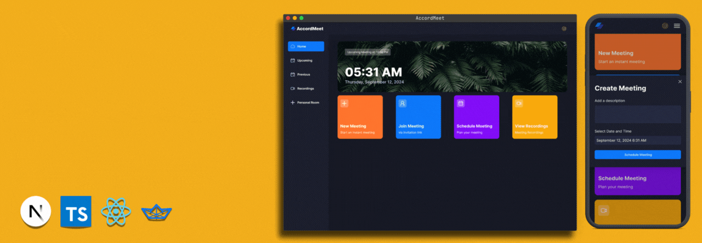

# AccordMeet a modern meeting App

- Author : [Aymane Sadiki](https://github.com/AymanSdk)

---


Developed using the latest technologies such as Next.js and TypeScript, this project enables users to securely log in, create meetings, and utilize a range of meeting features including recording, screen sharing, and participant management.

## Tech Stack

- Next.js
- TypeScript
- Clerk
- getstream
- shadcn
- Tailwind CSS

## Features

- **Authentication**: Provides secure login and authorization features using Clerk, allowing users to sign in via social accounts or traditional email and password methods while managing access levels and permissions.
- **New Meeting**: Start a new meeting quickly and configure camera and microphone settings before joining.

- **Meeting Controls**: Manage various aspects of the meeting including recording, emoji reactions, screen sharing, muting/unmuting, sound adjustments, grid layout, participant list view, and participant management (pinning, muting, unmuting, blocking, allowing video share).

- **Exit Meeting**: Participants can leave a meeting, or the creator can end it for all attendees.

- **Schedule Future Meetings**: Enter meeting details (date, time) to schedule future meetings, which can be accessed on the 'Upcoming Meetings' page for sharing the link or immediate start.

- **Past Meetings List**: View a list of previously held meetings along with details and metadata.

- **View Recorded Meetings**: Access recordings of past meetings for review or reference.

- **Personal Room**: Users have a personal room with a unique meeting link for instant meetings, which can be shared with others.

- **Join Meetings via Link**: Join meetings created by others by using a provided link.

- **Secure Real-time Functionality**: Ensure all interactions are secure and occur in real-time, maintaining user privacy and data integrity.

## Quick Start

Follow these steps to set up the project locally :

### Prerequisites

Ensure you have the following prerequisites installed :

- Git
- Node.js
- npm (Node Package Manager)

### Cloning the Repository

```bash
git https://github.com/AymanSdk/AccordMett_Meeting-App.git
cd AccordMett_Meeting-App
```

### Installation

Install the project dependencies using npm:

```bash
npm install
```

### Set Up Environment Variables

Create a file named `.env` in the root of your project and add the following content:

```
NEXT_PUBLIC_CLERK_PUBLISHABLE_KEY=
CLERK_SECRET_KEY=

NEXT_PUBLIC_CLERK_SIGN_IN_URL=/sign-in
NEXT_PUBLIC_CLERK_SIGN_UP_URL=/sign-up

NEXT_PUBLIC_STREAM_API_KEY=
STREAM_SECRET_KEY=
```

Replace the placeholder values with your actual Clerk and getstream credentials. You can obtain these credentials by signing up on the Clerk and getstream websites:

- [Clerk website](https://clerk.com/?utm_source=clerk&utm_medium=components&_gl=1*1pv1zr7*_gcl_au*MTk2NDYwOTEyLjE3MTYwNDg4MzIuMTAyMzA4MjAwMS4xNzE3ODIwNDc1LjE3MTc4MjA0NzQ.*_ga*MTYxNDgxNzE3NS4xNzE2MDQ4ODMy*_ga_1WMF5X234K*MTcxOTk0NTY3Mi41LjAuMTcxOTk0NTY3Mi4wLjAuMA..)
- [GetSteam Website](https://getstream.io/accounts/login/?login=1&next=/dashboard/)

### Running the Project

To start the project, run:

```bash
npm run dev
```

Open [http://localhost:3000](http://localhost:3000) in your browser to view the project.
